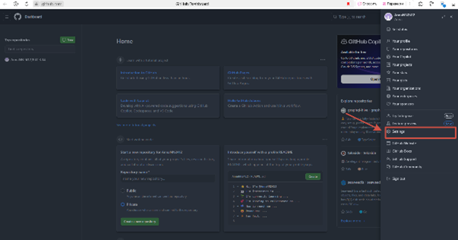
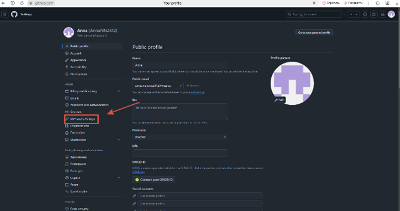
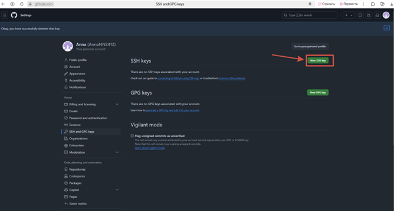
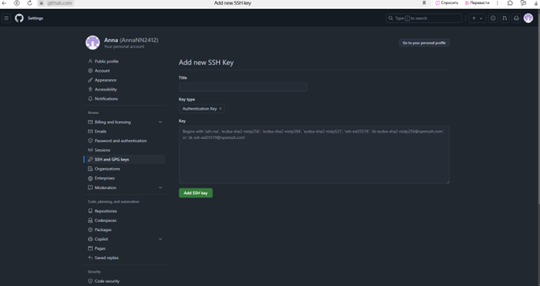
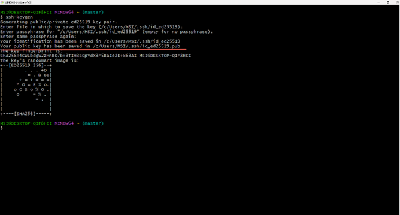
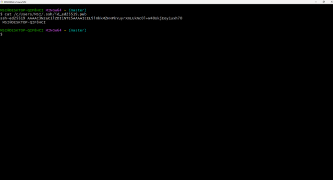

## Установка SSH-ключа

&nbsp;&nbsp;&nbsp;&nbsp;&nbsp;&nbsp;SSH-ключ — это пара криптографических ключей, которая состоит из открытого и закрытого ключа:

+ Открытый ключ отвечает за шифрование данных. Он размещается на сервере, к которому необходимо подключаться;

+ Закрытый ключ нужен для расшифровки данных. Он всегда хранится на устройстве пользователя и может быть дополнительно защищён паролем для усиления безопасности.

### Основные функции SSH:

+ *Передача данных.* Через защищённое соединение можно передавать почту, видео, изображения и другие файлы;

+ *Удалённый запуск программ и выполнение команд на сервере.* Это возможно через командную строку;

+ *Сжатие файлов.* Это нужно для удобной передачи данных;

+ *Переадресация портов.* С её помощью можно передавать шифрованный трафик между портами разных машин;

+ *Аутентификация пользователей.* Протокол поддерживает разные способы авторизации, в том числе обычные пароли для подключения и более надёжные SSH-ключи;

+ *Автоматизация некоторых задач.* Например, можно настроить резервное копирование данных с высоким уровнем безопасности, автоматическое выполнение сценариев по обновлению нескольких серверов и мониторинг состояния оборудования.

## Установка SSH-ключа на GitHub:

1. Заходим на GitHub. Находим вкладку настройки.



2. В настройках, находим вкладку SSH and GPG keys.



3. Нажимаем на зелёную кнопку, <font color="green">New SSH key.</font>



В этом окне, нам нужно ввести название ключа и сам ключ.



**Откуда брать ключ.** Заходим в командную строку *Git Bush*. Вводим `ssh-keygen`. Нажимаем *enter*, пока вся нужная информация не выведется.
В выведенной информации, находим строку, в которой указан *путь до файла* с публичным ssh-ключом.



4. Копируем этот путь. Вводим команду 
```
$ cat /c/Users/MSI/.ssh/id_ed25519.pub
```
Команда `cat` – выводит содержимое файла в консоль.
Копируем текст, который нам вывела команда.



5. И вставляем его на сайт *GitHub*, в окно с ключом. Ключ готов к использованию.

[Вернуться обратно](README.md)

